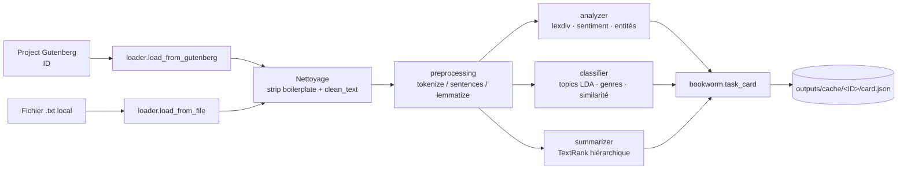
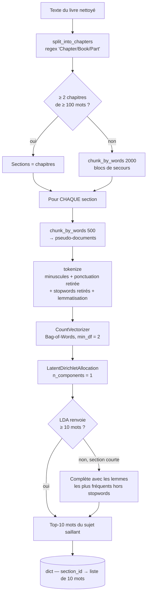
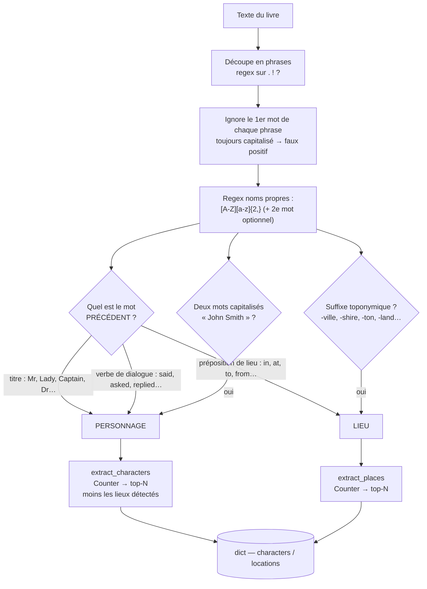
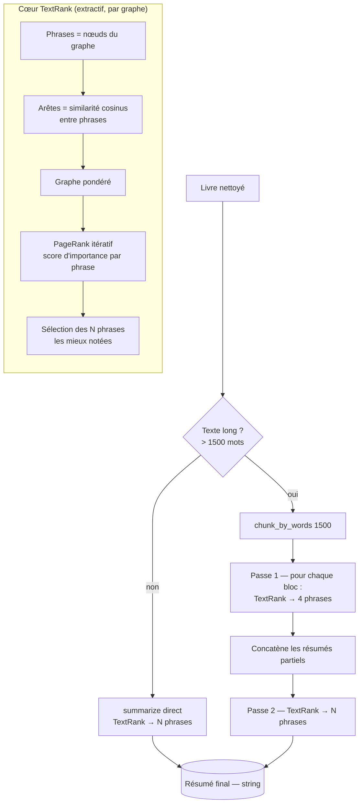
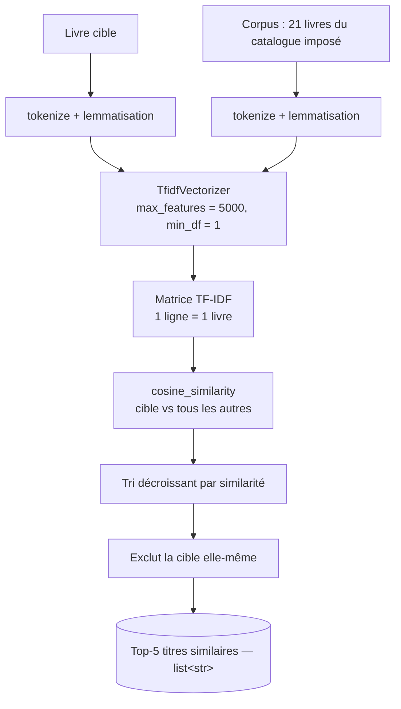
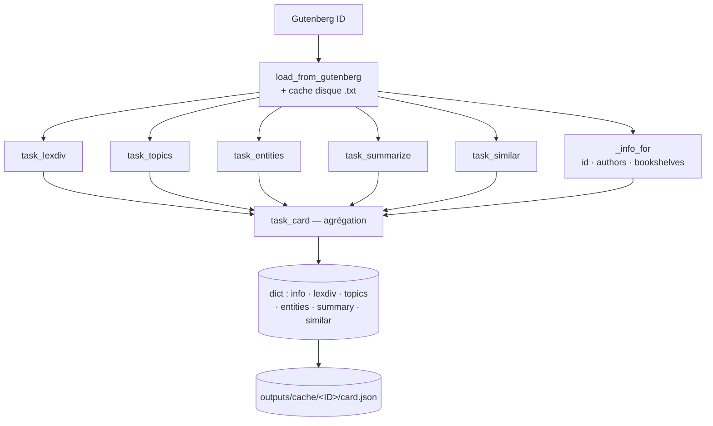

# Diagrammes des pipelines NLP — T-ALICE

Ce document illustre, sous forme de diagrammes, le **parcours de traitement** de
chaque grande fonctionnalité du projet. Les diagrammes sont écrits en
[Mermaid](https://mermaid.js.org/) : ils s'affichent automatiquement sur GitHub
et peuvent être exportés en image pour une présentation.

> Convention de lecture : un rectangle = une étape de code (fonction réelle du
> projet), un losange = une décision, un cylindre = une sortie persistée.

---

## 0. Vue d'ensemble — du livre à la « book card »



**Point clé (trophée « faire le ménage ») :** le nettoyage est la **première**
étape, avant toute tokenisation, vectorisation ou analyse. Sans lui, l'en-tête
légal Gutenberg polluerait les résumés et les fréquences de mots.

---

## 1. Modélisation des sujets — `--topics` (trophée *sujets-doc*)



**Choix de modélisation :** une LDA par section (`n_components=1`) donne le sujet
*dominant* de chaque chapitre — plus lisible pour une fiche qu'une LDA globale
qui mélange tous les thèmes. Le repli sur les fréquences garantit toujours
10 mots, même sur un chapitre trop court pour que LDA converge.

---

## 2. Reconnaissance d'entités nommées — `--entities` (trophée *entités_doc*)



**Choix de NER :** heuristique par **casse + contexte**, sans dépendance lourde
(pas de spaCy ni de modèle à télécharger → meilleure *portabilité*). La
désambiguïsation personnage/lieu repose sur le mot précédent (titre/verbe de
dialogue ⇒ personne ; préposition de lieu/suffixe ⇒ lieu). Limite assumée :
quelques faux positifs sur les romans (institutions, apostrophes).

---

## 3. Résumé automatique — `--summarize` (trophée *résumé_doc*)



**Choix de résumé :** **extractif** (TextRank via `sumy`) plutôt qu'abstractif
(BART/T5) — pas de modèle de plusieurs centaines de Mo à télécharger, traitement
transparent et reproductible. Le **résumé hiérarchique en 2 passes** est
indispensable pour un livre entier : résumer 25 000 mots d'un coup fait exploser
la mémoire de l'algorithme de graphe.

---

## 4. Recommandation de livres similaires — `--similar` (trophée *document similaire*)



**Choix de reco :** **TF-IDF + similarité cosinus**. TF-IDF écrase les mots
communs à tous les livres et fait ressortir le vocabulaire discriminant ; le
cosinus mesure l'angle entre deux profils lexicaux, indépendamment de la
longueur des livres. Simple, interprétable, sans entraînement.

---

## 5. Carte de livre — `--card` (trophée *carte de livre*)



Chaque sous-tâche est **mise en cache** individuellement : un second appel
(`--card`, ou n'importe quelle sous-commande) relit le JSON au lieu de tout
recalculer.

---

## Export en image (pour la présentation)

Les diagrammes ci-dessus se rendent nativement sur GitHub. Pour les projeter en
slides, deux options :

```bash
# 1) Mermaid CLI (Node)
npx -p @mermaid-js/mermaid-cli mmdc -i docs/pipelines.md -o docs/pipeline.png

# 2) Éditeur en ligne : copier un bloc ```mermaid``` dans https://mermaid.live
#    puis « Export PNG/SVG ».
```
